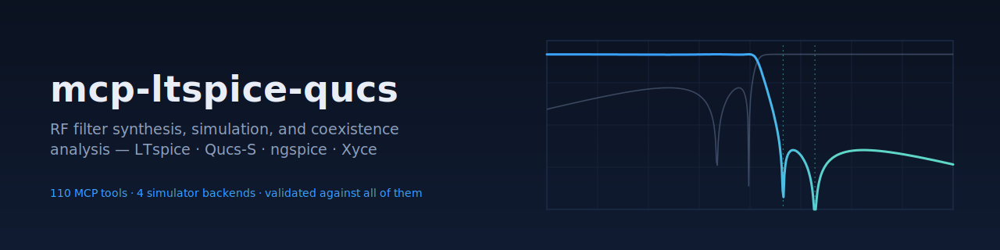

<div align="center">



<br/>

[](https://github.com/RFingAdam/mcp-ltspice-qucs/actions/workflows/ci.yml)
[](LICENSE)
[](https://www.python.org/downloads/)
[](https://github.com/astral-sh/ruff)
[](https://modelcontextprotocol.io)
[](https://github.com/RFingAdam/eng-mcp-suite)

**Design RF filters and switch-mode-power EMC from spec — three FastMCP servers driving LTspice, Qucs-S, and scikit-rf.**
**Iterate at the design-intent layer ("place a zero at 1.85 GHz", "predict conducted emissions against CISPR 32 Class B") from your terminal or AI agent.**

[Quick start](#quick-start) ·
[Tools](#tools) ·
[Workflows](#workflows) ·
[Documentation](#documentation)

</div>

---

## What is mcp-ltspice-qucs?

mcp-ltspice-qucs is a three-server MCP suite plus a shared contracts
library, all speaking **Touchstone** as the cross-tool exchange format.
It collapses a typical filter-design loop — hours of LTspice nudging
component values, swapping SPICE models, re-running, eyeballing S21 —
into an agent-driven iteration at the **design intent** layer.

Drive it from any MCP client. `mcp-ltspice` exposes 56 flat tools plus
matching namespaced aliases (`filter.*`, `power.*`, `analog.*`).
`mcp-qucs-s` adds native S-parameter sim and closed-form microstrip
synthesis with 16 substrate presets. `mcp-rf-analysis` adds
simulator-agnostic skrf wrappers, band databases, and FCC / ETSI / 3GPP
spec evaluation. Validated against the bundled example designs
(427 passing tests, 4 simulator-gated skips).

**What mcp-ltspice-qucs does well:**

- 🤖 **AI-native via MCP.** Three first-class [Model Context Protocol](https://modelcontextprotocol.io)
  servers. Any Claude / LLM agent can iterate filter topologies, sweep
  vendor parts, and run Monte Carlo yield analyses.
- 🧪 **Real simulators, not toy math.** Drives **LTspice** (with ngspice
  fallback) for time + AC + noise sweeps, **Qucs-S** for native
  S-parameter sim with harmonic-balance scaffolding.
- 📐 **Closed-form synthesis + optimization.** LC ladder (Butterworth /
  Chebyshev / Elliptic, LPF/HPF/BPF/BSF), Sallen-Key, MFB, Richards-
  Kuroda lumped-to-distributed, Hammerstad-Jensen microstrip.
- ⚡ **Vendor parasitics built in.** Coilcraft 0402HP, Murata GJM, Johanson,
  TDK SPICE models with E24/E96/E192 snap.
- ✅ **CISPR-aware.** Conducted-emission prediction against CISPR 22 /
  CISPR 32 Class A / B before you build.
- 🔒 **AGPL-3.0-or-later.**

---

## Quick start

### Install

```bash
git clone https://github.com/RFingAdam/mcp-ltspice-qucs.git
cd mcp-ltspice-qucs
uv sync --all-packages
uv run pytest -q                  # 427 pass, 4 simulator-gated skips
uv run python examples/basic_lpf/design.py
```

See [`docs/installation.md`](docs/installation.md) for ngspice / LTspice /
Qucs-S external-tool setup.

### Wire it into your MCP client

**Claude Code:**
```bash
claude mcp add ltspice -- uv run --directory /path/to/mcp-ltspice-qucs/packages/mcp-ltspice mcp-ltspice
claude mcp add qucs-s  -- uv run --directory /path/to/mcp-ltspice-qucs/packages/mcp-qucs-s  mcp-qucs-s
claude mcp add rf-analysis -- uv run --directory /path/to/mcp-ltspice-qucs/packages/mcp-rf-analysis mcp-rf-analysis
```

Then ask your assistant:

> *"Synthesize a 5th-order Butterworth LPF at fc = 1 GHz, swap in Coilcraft 0402HP and Murata GJM C0G parts at 5% tolerance, and report yield."*

The agent calls `synthesize_lc_filter`, `substitute_real_components`,
and `monte_carlo_analysis` in sequence. Demo result on the bundled LPF
example: **all 5 spec criteria pass at 99% yield.**

---

## Tools

`mcp-ltspice-qucs` ships three MCP servers, 99 tools total:

| Server                | Tools | Purpose                                                                 |
| --------------------- | ----: | ----------------------------------------------------------------------- |
| **`mcp-ltspice`**     | 56    | LTspice + ngspice. LC ladder synth, vendor parts, Monte Carlo, SMPS sizing + EMC, active filters, op-amp/MOSFET/BJT/diode/Vref catalogs |
| **`mcp-qucs-s`**      | 10    | Qucs-S native S-param sim. Microstrip + 16 substrate presets, couplers, Richards-Kuroda |
| **`mcp-rf-analysis`** | 33    | Touchstone I/O, skrf wrappers, LTE / 5G NR / ISM / HaLow / GNSS bands, FCC / ETSI / 3GPP eval, coexistence matrix |

Tools register under both flat names (back-compat) and categorised
aliases (`filter.*`, `power.*`, `analog.*`, `digital.*`, `vendor.*`,
`sim.*`). Full reference in
[`docs/tool-catalog.md`](docs/tool-catalog.md) +
[`docs/tools/`](docs/tools/) (one page per server).

---

## What it solves

| Workflow                 | Headline tools                                                   | Reference                          |
| ------------------------ | ---------------------------------------------------------------- | ---------------------------------- |
| LC ladder filter design  | `synthesize_lc_filter` → `place_transmission_zero` → `substitute_real_components` | Butterworth / Chebyshev / Elliptic |
| Active filter design     | `synthesize_sallen_key_lpf` / `_hpf` / `_bpf`, `synthesize_mfb_lpf` / `_bpf` | Sallen-Key, MFB                    |
| SMPS EMC pre-compliance  | `design_pi_filter`, `predict_conducted_emissions`, `design_snubber`, `design_cm_choke` | CISPR 22 / CISPR 32                |
| Microstrip + coupler     | `microstrip_synth`, `branchline_coupler`, `rat_race`, `lange_coupler` | Hammerstad-Jensen                  |
| Monte Carlo yield        | `monte_carlo_analysis` (joblib parallel)                         | Gaussian component tolerance       |
| Multi-radio coexistence  | `coexistence_matrix`, `lte_band_lookup`, `wifi_halow_channel`    | 3GPP TS 36.101, WiFi-HaLow         |

Five worked examples ship under [`examples/`](examples/):
`basic_lpf`, `buck_smps`, `emc_compliance`, `filter_compare`,
`opamp_filter`.

---

## Workflows

mcp-ltspice-qucs fits in the following [eng-mcp-suite](https://github.com/RFingAdam/eng-mcp-suite)
workflow bundles:

- **`rf-design`** — closed-form trans-line synthesis (lineforge) +
  wire-antenna MoM (mcp-nec2-antenna) + circuit/filter sim (this server).
- **`coexistence-review`** — multi-radio band picking + filter design
  against CISPR limits, fed into PCB layout review (mcp-pcb-emcopilot).

See the [suite manifest](https://github.com/RFingAdam/eng-mcp-suite/blob/main/manifest.yaml)
for the full list of sibling MCPs and bundle definitions.

---

## Scope and related MCP servers

This suite is **circuit-level + filter-synthesis** focused. Deliberately
stops at the antenna port and at the schematic-to-layout boundary. For:

- **Antenna design** → [`mcp-nec2-antenna`](https://github.com/RFingAdam/mcp-nec2-antenna)
  (wire / MoM) or [`mcp-openems`](https://github.com/RFingAdam/mcp-openems) (FDTD).
- **PCB-level EMC / SI / PI** → [`mcp-pcb-emcopilot`](https://github.com/RFingAdam/mcp-pcb-emcopilot).
- **Regulatory standards lookup** → [`mcp-emc-regulations`](https://github.com/RFingAdam/mcp-emc-regulations).
- **Physical-layer testing on real hardware** → a hardware-DUT MCP.

See [`docs/related-mcp-servers.md`](docs/related-mcp-servers.md) for the
full boundary statement, decision flow, and cross-MCP workflow examples.

---

## Documentation

- 📘 **[Getting started](docs/getting-started.md)** — install through first call.
- 🛠️ **[Tool catalog](docs/tool-catalog.md)** — all 99 tools, per-server pages under [`docs/tools/`](docs/tools/).
- 📐 **[Usage example](docs/usage.md)** — practical end-to-end walkthrough.
- 🏗️ **[Architecture](docs/architecture.md)** — interop contract between servers.
- 🔗 **[Suite architecture](docs/suite-architecture.md)** — how this MCP fits in eng-mcp-suite.
- 📝 **[Changelog](CHANGELOG.md)**

---

## Part of eng-mcp-suite

<sub>This MCP server is part of</sub>

[](https://github.com/RFingAdam/eng-mcp-suite)

<sub>An open umbrella for engineering MCP servers across RF, EMC, PCB,
signal integrity, EM simulation, and lab test. Same brand, same docs
structure, designed to compose. See the
[full catalog](https://github.com/RFingAdam/eng-mcp-suite#whats-included)
or jump to a sibling:</sub>

| Domain                      | Sibling MCPs                                                                 |
| --------------------------- | ---------------------------------------------------------------------------- |
| **RF / Transmission lines** | [lineforge](https://github.com/RFingAdam/lineforge)                          |
| **Antennas**                | [mcp-nec2-antenna](https://github.com/RFingAdam/mcp-nec2-antenna)            |
| **PCB / SI**                | [mcp-pcb-emcopilot](https://github.com/RFingAdam/mcp-pcb-emcopilot)          |
| **EMC regulatory**          | [mcp-emc-regulations](https://github.com/RFingAdam/mcp-emc-regulations)      |
| **EM simulation (3D)**      | [mcp-openems](https://github.com/RFingAdam/mcp-openems)                      |
| **Diagrams**                | [drawio-engineering-mcp](https://github.com/RFingAdam/drawio-engineering-mcp) |
| **Lab gear**                | [copper-mountain-vna-mcp](https://github.com/RFingAdam/copper-mountain-vna-mcp) |

---

## Contributing

Contributions are welcome.

1. **Pick a [GitHub issue](https://github.com/RFingAdam/mcp-ltspice-qucs/issues)**.
2. **Fork + branch** (`feature/your-thing` or `fix/your-bug`).
3. **Run the local check suite**:
   ```bash
   uv sync --all-packages
   uv run pytest -q
   uv run ruff check . && uv run ruff format --check .
   ```
4. **Open a PR** — link the issue, request review.

Full contributor guide in [`CONTRIBUTING.md`](CONTRIBUTING.md).

---

## License & changelog

[AGPL-3.0-or-later](LICENSE); per-release changes in [`CHANGELOG.md`](CHANGELOG.md)
([Keep a Changelog](https://keepachangelog.com/) format). Relicensed
from Apache-2.0 in v0.4.0 to align with the eng-mcp-suite toolkit-wide
AGPL move. Underlying Qucs-S (GPL), LTspice (proprietary), and
scikit-rf (BSD) are runtime-invoked dependencies, not redistributed
by these wrappers.

## Acknowledgments

- **[LTspice](https://www.analog.com/en/resources/design-tools-and-calculators/ltspice-simulator.html)** — Analog Devices' SPICE simulator.
- **[Qucs-S](https://ra3xdh.github.io/)** — Quite Universal Circuit Simulator with SPICE-compatible kernels.
- **[scikit-rf](https://scikit-rf.readthedocs.io/)** — Touchstone and S-parameter library underneath the analysis layer.
- **The MCP working group** — for the [Model Context Protocol](https://modelcontextprotocol.io) specification.

<div align="center">

<sub>Part of <a href="https://github.com/RFingAdam/eng-mcp-suite">eng-mcp-suite</a> — built for RF engineers, EMC labs, and AI agents.</sub>

</div>
