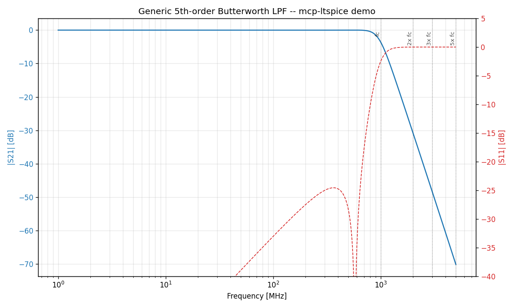

<p align="center">
  
</p>

<p align="center">
  <a href="https://opensource.org/licenses/Apache-2.0"></a>
  <a href="https://www.python.org/downloads/"></a>
  <a href="https://github.com/astral-sh/ruff"></a>
  <a href="https://github.com/RFingAdam/mcp-ltspice-qucs/actions/workflows/ci.yml"></a>
</p>

# mcp-ltspice-qucs

MCP servers for RF filter and SMPS-EMC design from spec — three
FastMCP servers plus a shared contracts library. Drives **LTspice**
and **Qucs-S** through domain-aware tool calls ("place a transmission
zero at 1853 MHz", "predict this buck's conducted emissions against
CISPR 32 Class B") so an LLM agent can iterate at the design-intent
layer instead of SPICE primitives. `mcp-ltspice` exposes 56 flat tools
plus matching namespaced aliases (`filter.*`, `power.*`, `analog.*`);
the other two servers add their own surface on top.

## Why this exists

Designing a single coexistence-aware filter today looks like: hours in
LTspice nudging component values, swapping vendor SPICE models by hand,
re-running the sim, eyeballing the S21 trace, repeat. This suite codifies
the workflow so an LLM agent can iterate at the **design intent** layer,
collapsing each iteration from minutes to seconds while keeping a
human-engineer in the loop for judgment calls.

## What's in the box

Three FastMCP servers + one shared library. Tools register under both
flat names (back-compat) and categorised aliases (`filter.*`,
`power.*`, `analog.*`, `digital.*`, `vendor.*`, `sim.*`).

| Package | Purpose |
|---|---|
| **`mcp-ltspice`** | LTspice + ngspice fallback. LC ladder synthesis (Butterworth · Chebyshev · Elliptic, LPF/HPF/BPF/BSF), transmission-zero placement, vendor part substitution with parasitics, optimisation, Monte Carlo yield, SMPS sizing (buck/boost/LDO), SMPS-EMC pre-compliance (Pi filter, DM filter, conducted-emissions vs CISPR 22/32, snubber, CM choke), active filters (Sallen-Key / MFB), op-amp / MOSFET / BJT / diode / Vref catalogues. |
| **`mcp-qucs-s`** | Qucs-S for native S-parameter sim. Closed-form microstrip synthesis (Hammerstad-Jensen) with **16 substrate presets** (FR-4, Rogers 4350B / 4003C, RT/Duroid 5880 / 6002, Isola FR408HR, Taconic TLY5) and conductor + dielectric loss. Branch-line / rat-race / Lange / coupled-line couplers. Richards-Kuroda lumped-to-distributed. Harmonic balance and noise extraction are scaffolded — see [`packages/mcp-qucs-s/README.md`](packages/mcp-qucs-s/README.md). |
| **`mcp-rf-analysis`** | Simulator-agnostic skrf wrappers, LTE / 5G NR / GNSS / ISM / HaLow band databases, FCC / ETSI / 3GPP spec evaluation, multi-radio coex matrix. |
| **`rf-mcp-common`** | Shared library — `Envelope[T]` response model, Touchstone I/O (Hz-strict), E24/E96/E192 snap, structured logger. Not an MCP server. |

All servers speak **Touchstone** (`.s2p` / `.snp`) as the cross-tool
exchange format. See [`ARCHITECTURE.md`](ARCHITECTURE.md) for the
interop contract.

## Headline demo

The [basic LPF example](examples/basic_lpf/) synthesises a 5th-order
Butterworth low-pass filter at fc = 1 GHz, substitutes Coilcraft 0402HP
and Murata GJM C0G real parts, evaluates against a generic spec, and
runs a 1000-trial Monte Carlo at 5% component tolerance — all through
MCP tool calls. **All 5 spec criteria pass with 99% yield.**



| Criterion | Target | Measured | Margin |
|---|---|---|---|
| Passband IL | ≤ 0.5 dB | 0.02 dB | +0.48 dB |
| Passband RL | ≥ 14 dB | 24.57 dB | +10.57 dB |
| 2 × fc | ≥ 30 dB | 30.85 dB | +0.85 dB |
| 3 × fc | ≥ 45 dB | 48.16 dB | +3.16 dB |
| 5 × fc | ≥ 60 dB | 70.16 dB | +10.16 dB |

Four more worked designs ship under `examples/`:
[`buck_smps`](examples/buck_smps/) (5 V buck with type-II compensator),
[`emc_compliance`](examples/emc_compliance/) (CISPR 32 conducted
emissions prediction), [`filter_compare`](examples/filter_compare/)
(comparing 5/7/9-order elliptic LPFs against a spec), and
[`opamp_filter`](examples/opamp_filter/) (4th-order Sallen-Key with
op-amp recommendation).

Drop your own designs under `examples/private/` or `examples/_local/`
(both gitignored).

## Quickstart

```bash
git clone https://github.com/RFingAdam/mcp-ltspice-qucs
cd mcp-ltspice-qucs
uv sync --all-packages
uv run pytest -q                       # 427 pass, 4 simulator-gated skips
uv run python examples/basic_lpf/design.py
```

See [`docs/installation.md`](docs/installation.md) for ngspice / LTspice /
Qucs-S setup, [`ARCHITECTURE.md`](ARCHITECTURE.md) for the interop
contract between servers, and [`presentation/OVERVIEW.md`](presentation/OVERVIEW.md)
for a higher-level briefing with rendered demo charts.

## Scope and related MCP servers

This MCP suite is **circuit-level + filter-synthesis** focused. It
deliberately stops at the antenna port and at the schematic-to-layout
boundary. For domains this suite does *not* cover:

- **Antenna design** (radiation patterns) → use a NEC2 method-of-moments or FDTD full-wave EM MCP
- **PCB-level EMC / SI / PI** (impedance from layout, decoupling, return paths, crosstalk from geometry) → use a PCB-layout-aware EMC MCP
- **Regulatory standards lookup** (CISPR / FCC / ETSI / 3GPP / IEC / ISO, certification matrix, market requirements) → use [`mcp-emc-regulations`](https://github.com/RFingAdam/mcp-emc-regulations)
- **Physical-layer testing** (BLE / WiFi / HaLow on real hardware) → use a hardware-DUT RF test MCP

See [`docs/related-mcp-servers.md`](docs/related-mcp-servers.md) for the
full boundary statement, decision flow, and cross-MCP workflow examples.

## License & changelog

Apache-2.0; see [LICENSE](LICENSE). Per-release changes are documented
in [CHANGELOG.md](CHANGELOG.md) ([Keep a Changelog](https://keepachangelog.com/) format).
