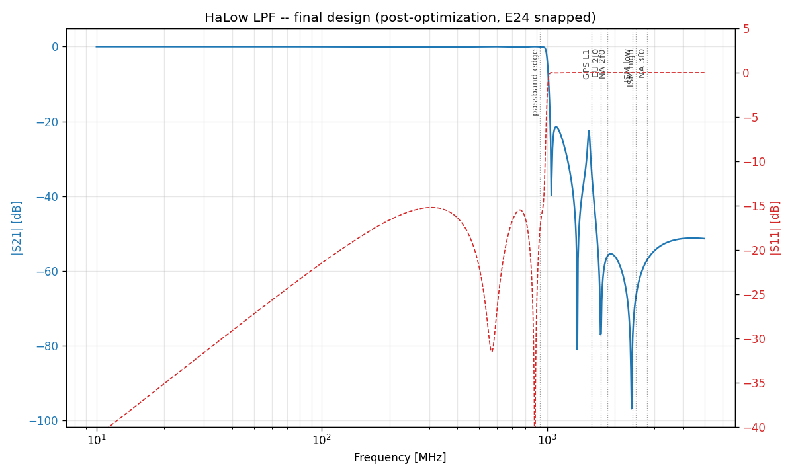

# mcp-ltspice-qucs

[](https://opensource.org/licenses/Apache-2.0)
[](https://www.python.org/downloads/)
[](https://github.com/astral-sh/ruff)

A three-server **Model Context Protocol (MCP)** suite that turns RF filter
design and multi-radio coexistence engineering into a fluent agent
workflow. Use **LTspice** and **Qucs-S** through domain-aware abstractions
("place a transmission zero at 1853 MHz", "evaluate against this coex
spec") instead of SPICE primitives.

## Why this exists

Designing a single coexistence-aware filter today looks like: hours in
LTspice nudging component values, swapping vendor SPICE models by hand,
re-running the sim, eyeballing the S21 trace, repeat. This suite codifies
the workflow so an LLM agent can iterate at the **design intent** layer,
collapsing each iteration from minutes to seconds while keeping a
human-engineer in the loop for judgment calls.

## The three servers

| Server | Purpose |
|---|---|
| **`mcp-ltspice`** | LTspice (and ngspice fallback) for lumped-element filter synthesis, S-parameter extraction, vendor model substitution, optimization, Monte Carlo |
| **`mcp-qucs-s`** | Qucs-S for native S-parameter sims, harmonic balance, microstrip / distributed-element synthesis, Richards/Kuroda lumped→distributed conversion |
| **`mcp-rf-analysis`** | Simulator-agnostic skrf wrappers, LTE/5G NR/GNSS/ISM/HaLow band databases, FCC/ETSI/3GPP spec evaluation, multi-radio coex matrix |

All three speak **Touchstone** (`.s2p`/`.snp`) as the cross-tool exchange
format.

## Headline demo

The [HaLow LPF example](examples/halow_lpf/) finalizes a 9th-order
elliptic low-pass filter for an 802.11ah HaLow + LTE + WiFi + BLE + GNSS
device, hitting **all 8 coex spec targets** with **86.6% Monte-Carlo yield**
at 2% component tolerance — entirely through MCP tool calls.



Final spec compliance (regenerated each run; details in
[`report.md`](examples/halow_lpf/report.md)):

| Criterion | Target | Measured | Margin |
|---|---|---|---|
| Passband IL | ≤ 0.5 dB | 0.13 dB | +0.37 dB |
| Passband RL | ≥ 15 dB | 15.22 dB | +0.22 dB |
| GPS L1 protection | ≥ 30 dB | 33.05 dB | +3.05 dB |
| EU 2f₀ (LTE B3 UL) | ≥ 55 dB | 82.22 dB | +27.22 dB |
| NA 2f₀ (LTE B25 DL) | ≥ 55 dB | 56.08 dB | +1.08 dB |
| ISM 2.4G low (BLE/WiFi) | ≥ 30 dB | 77.58 dB | +47.58 dB |
| ISM 2.4G high | ≥ 30 dB | 66.66 dB | +36.66 dB |
| NA 3f₀ | ≥ 40 dB | 57.11 dB | +17.11 dB |

## Quickstart

```bash
git clone https://github.com/RFingAdam/mcp-ltspice-qucs
cd mcp-ltspice-qucs
uv sync
uv run python examples/halow_lpf/design.py
```

See [`docs/installation.md`](docs/installation.md) for ngspice / LTspice /
Qucs-S setup, and [`docs/architecture.md`](docs/architecture.md) for the
interop contract between servers.

## License

Apache-2.0. See [LICENSE](LICENSE).
