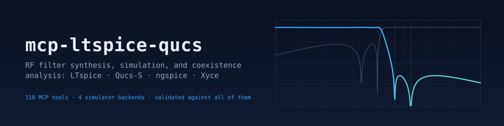

<div align="center">



<br/>

[](https://github.com/RFingAdam/mcp-ltspice-qucs/actions/workflows/ci.yml)
[](LICENSE)
[](https://www.python.org/downloads/)
[](https://github.com/astral-sh/ruff)
[](https://modelcontextprotocol.io)
[](https://github.com/RFingAdam/eng-mcp-suite)

**Design RF filters and switch-mode-power EMC from spec. Three FastMCP servers driving LTspice, Qucs-S, and scikit-rf.**
**Iterate at the design-intent layer ("place a zero at 1.85 GHz", "predict conducted emissions against CISPR 32 Class B") from your terminal or AI agent.**

[Quick start](#quick-start) ·
[Tools](#tools) ·
[Workflows](#workflows) ·
[Documentation](#documentation)

</div>

---

## What is mcp-ltspice-qucs?

mcp-ltspice-qucs is a three-server MCP suite plus a shared contracts
library, all speaking **Touchstone** as the cross-tool exchange format.
It collapses a typical filter-design loop: hours of LTspice nudging
component values, swapping SPICE models, re-running, eyeballing S21:
into an agent-driven iteration at the **design intent** layer.

Drive it from any MCP client. `mcp-ltspice` exposes 76 primary tools plus
59 namespaced aliases (`filter.*`, `power.*`, `analog.*`, and others).
`mcp-qucs-s` adds native S-parameter simulation, Xyce harmonic balance,
and closed-form microstrip / distributed-filter synthesis with 16
substrate presets. `mcp-rf-analysis` adds simulator-agnostic skrf
wrappers, band databases, FCC / ETSI / 3GPP spec evaluation, and
multi-radio coexistence analysis. Selected LC, Qucs-S, and Xyce paths
have real-simulator integration tests. Required per-commit CI installs
ngspice; the weekly self-hosted matrix executes LTspice, qucsator-RF,
and Xyce instead of treating an absent backend as a pass.

**What mcp-ltspice-qucs does well:**

- **AI-native via MCP.** Three first-class [Model Context Protocol](https://modelcontextprotocol.io)
  servers. Any MCP agent can iterate filter topologies, sweep vendor
  parts, and run Monte Carlo yield analyses.
- **Real simulator drivers plus fast analytical models.** Drives **LTspice** (native or
  under Wine), **ngspice**, **Qucs-S / qucsator-RF** for native
  S-parameter simulation, and **Xyce** for harmonic balance. Selected
  analytical ladder cases are cross-checked against simulator output.
- **Closed-form synthesis and optimization.** LC ladders (Butterworth /
  Chebyshev / elliptic, all of LPF / HPF / BPF / BSF including elliptic
  band-transforms), Sallen-Key, MFB, Richards-Kuroda, and a complete
  distributed set: stepped-impedance, edge-coupled, hairpin,
  interdigital, and combline microstrip filters on an exact
  coupled-line TEM model.
- **Coexistence-driven design.** Victim-weighted transmission-zero
  placement against LTE / 5G NR / GNSS / FCC-restricted bands, a
  GNSS ΔC/N₀ desense model, and a closed loop that iterates filter
  order until the coex matrix meets a desense target.
- **Circuit-file workbench and model-aware optimization.** Supported LTspice
  ASC, SPICE, Qucs schematic, and Qucsator netlist files import into a
  connectivity-preserving `CircuitDocument` 1.0 or return a complete
  unsupported-construct report. Component search enforces package,
  availability, ratings, Q/SRF, bias, temperature, and tolerance. Generic IR
  optimization preserves topology, evaluates corners/yield, instantiates exact
  selected models, and can require an independent final simulator before
  reporting `simulator_validated`.
- **CISPR-aware.** Conducted and radiated emission prediction against
  CISPR 22 / 32 and FCC Part 15 limits, anchored to closed-form
  references, before you build.

---

## Quick start

### Install

```bash
git clone https://github.com/RFingAdam/mcp-ltspice-qucs.git
cd mcp-ltspice-qucs
uv sync --all-packages
uv run pytest -q                  # simulator-gated tests skip when tools are absent
uv run python examples/basic_lpf/design.py
```

See [`docs/installation.md`](docs/installation.md) for ngspice / LTspice /
Qucs-S external-tool setup.
The [general circuit workbench guide](docs/circuit-workbench.md) documents
file-format boundaries, backend adapters, tolerance policies, component search,
and generic optimization.

### Wire it into your MCP client

The repository includes a tested [Codex project
configuration](.codex/config.toml) and [Claude Code project
configuration](.mcp.json). Trust the repository in the client, then inspect
the three connected servers.

**Claude Code:**
```bash
claude mcp list
```

Then ask your assistant:

> *"Synthesize a 5th-order Butterworth LPF at fc = 1 GHz, swap in Coilcraft 0402HP and Murata GJM C0G parts at 5% tolerance, and report yield."*

The agent calls `synthesize_lc_filter`, `substitute_real_components`,
and `monte_carlo_analysis` in sequence. The bundled LPF's analytical
preview reports **all 5 spec criteria passing at 99% yield** using
catalog-snapped ideal values; verify the realized circuit in SPICE
before treating that number as production evidence.

---

## Tools

`mcp-ltspice-qucs` ships three MCP servers with 140 primary tools
(199 registrations when the 59 deprecated `mcp-ltspice` aliases are included):

| Server                | Tools | Purpose                                                                 |
| --------------------- | ----: | ----------------------------------------------------------------------- |
| **`mcp-ltspice`**     | 76    | LTspice + ngspice. Circuit IR import/export, durable jobs/artifacts, generic model-aware optimization, LC ladder synthesis, coex-driven design, Monte Carlo, SMPS sizing + EMC, active filters, device catalogs |
| **`mcp-qucs-s`**      | 29    | Qucs schematic/netlist IR import/export, durable simulation jobs, native S-param simulation + Xyce harmonic balance, microstrip + 16 substrate presets, couplers, and distributed filters |
| **`mcp-rf-analysis`** | 35    | Touchstone I/O, skrf wrappers, readiness probing, LTE / 5G NR / ISM / HaLow / GNSS bands, FCC / ETSI / 3GPP eval, coex matrix with GNSS ΔC/N₀ model, victim-weighted zero placement, EMC predictors |

The underscore-separated names are canonical. The categorised dotted aliases
(`filter.*`, `power.*`, `analog.*`, `digital.*`, `vendor.*`, `sim.*`) are
deprecated compatibility names scheduled for removal in 1.0. Full reference in
[`docs/tool-catalog.md`](docs/tool-catalog.md) +
[`docs/tools/`](docs/tools/) (one page per server).

---

## What it solves

| Workflow                 | Headline tools                                                   | Reference                          |
| ------------------------ | ---------------------------------------------------------------- | ---------------------------------- |
| LC ladder filter design  | `synthesize_lc_filter` → `place_transmission_zero` → `substitute_real_components` | Butterworth / Chebyshev / Elliptic |
| Active filter design     | `sallen_key_low_pass` / `sallen_key_high_pass` / `sallen_key_band_pass`, `mfb_low_pass` / `mfb_band_pass` | Sallen-Key, MFB                    |
| SMPS EMC pre-compliance  | `design_pi_output_filter`, `predict_conducted_emissions`, `design_rc_snubber`, `design_cm_choke` | CISPR 22 / CISPR 32                |
| Microstrip + coupler     | `synthesize_microstrip_line`, `synthesize_coupler` | Hammerstad-Jensen                  |
| Monte Carlo yield        | `monte_carlo_analysis` (joblib parallel)                         | Gaussian component tolerance       |
| Distributed filters      | `synthesize_stepped_impedance_lpf`, `synthesize_coupled_line_bpf`, `synthesize_hairpin_bpf`, `synthesize_interdigital_bpf`, `synthesize_combline_bpf` | Pozar §8.6-8.7, exact TEM N-line model |
| Multi-radio coexistence  | `place_zeros_for_coex` → `synthesize_for_coex_target` → `check_coex_matrix` (GNSS ΔC/N₀) | 3GPP TS 36.101, FCC restricted bands |

Five worked examples ship under [`examples/`](examples/):
`basic_lpf`, `buck_smps`, `emc_compliance`, `filter_compare`,
`opamp_filter`.

---

## Workflows

mcp-ltspice-qucs fits in the following [eng-mcp-suite](https://github.com/RFingAdam/eng-mcp-suite)
workflow bundles:

- **`rf-design`**: closed-form trans-line synthesis (lineforge) +
  wire-antenna MoM (mcp-nec2-antenna) + circuit/filter sim (this server).
- **`coexistence-review`**: multi-radio band picking + filter design
  against CISPR limits, fed into PCB layout review (mcp-pcb-emcopilot).

See the [suite manifest](https://github.com/RFingAdam/eng-mcp-suite/blob/main/manifest.yaml)
for the full list of sibling MCPs and bundle definitions.

---

## Scope and related MCP servers

This suite is **circuit-level + filter-synthesis** focused. Deliberately
stops at the antenna port and at the schematic-to-layout boundary. For:

- **Antenna design** → [`mcp-nec2-antenna`](https://github.com/RFingAdam/mcp-nec2-antenna)
  (wire / MoM) or [`mcp-openems`](https://github.com/RFingAdam/mcp-openems) (FDTD).
- **PCB-level EMC / SI / PI** → [`mcp-pcb-emcopilot`](https://github.com/RFingAdam/mcp-pcb-emcopilot).
- **Regulatory standards lookup** → [`mcp-emc-regulations`](https://github.com/RFingAdam/mcp-emc-regulations).
- **Physical-layer testing on real hardware** → a hardware-DUT MCP.

See [`docs/related-mcp-servers.md`](docs/related-mcp-servers.md) for the
full boundary statement, decision flow, and cross-MCP workflow examples.

---

## Documentation

- **[Getting started](docs/getting-started.md)**: install through first call.
- **[Tool catalog](docs/tool-catalog.md)**. All 140 primary tools, per-server pages under [`docs/tools/`](docs/tools/).
- **[Backend matrix](docs/backend-matrix.md)**: runtime readiness and CI validation tiers.
- **[Migration guide](docs/migration-0.5.md)**: canonical names, error semantics, jobs, and numerical changes.
- **[Usage example](docs/usage.md)**: practical end-to-end walkthrough.
- **[Architecture](docs/architecture.md)**: interop contract between servers.
- **[Suite architecture](docs/suite-architecture.md)**: how this MCP fits in eng-mcp-suite.
- **[Changelog](CHANGELOG.md)**

---

## Part of eng-mcp-suite

<sub>This MCP server is part of</sub>

[](https://github.com/RFingAdam/eng-mcp-suite)

<sub>An open umbrella for engineering MCP servers across RF, EMC, PCB,
signal integrity, EM simulation, and lab test. Same brand, same docs
structure, designed to compose. See the
[full catalog](https://github.com/RFingAdam/eng-mcp-suite#whats-included)
or jump to a sibling:</sub>

| Domain                      | Sibling MCPs                                                                 |
| --------------------------- | ---------------------------------------------------------------------------- |
| **RF / Transmission lines** | [lineforge](https://github.com/RFingAdam/lineforge)                          |
| **Antennas**                | [mcp-nec2-antenna](https://github.com/RFingAdam/mcp-nec2-antenna)            |
| **PCB / SI**                | [mcp-pcb-emcopilot](https://github.com/RFingAdam/mcp-pcb-emcopilot)          |
| **EMC regulatory**          | [mcp-emc-regulations](https://github.com/RFingAdam/mcp-emc-regulations)      |
| **EM simulation (3D)**      | [mcp-openems](https://github.com/RFingAdam/mcp-openems)                      |
| **Diagrams**                | [drawio-engineering-mcp](https://github.com/RFingAdam/drawio-engineering-mcp) |
| **Lab gear**                | [copper-mountain-vna-mcp](https://github.com/RFingAdam/copper-mountain-vna-mcp) |

---

## Contributing

Contributions are welcome.

1. **Pick a [GitHub issue](https://github.com/RFingAdam/mcp-ltspice-qucs/issues)**.
2. **Fork + branch** (`feature/your-thing` or `fix/your-bug`).
3. **Run the local check suite**:
   ```bash
   uv sync --all-packages
   uv run pytest -q
   uv run ruff check . && uv run ruff format --check .
   ```
4. **Open a PR**: link the issue, request review.

Full contributor guide in [`CONTRIBUTING.md`](CONTRIBUTING.md).

---

## License & changelog

[AGPL-3.0-or-later](LICENSE); per-release changes in [`CHANGELOG.md`](CHANGELOG.md)
([Keep a Changelog](https://keepachangelog.com/) format). Relicensed
from Apache-2.0 in v0.4.0 to align with the eng-mcp-suite toolkit-wide
AGPL move. Underlying Qucs-S (GPL), LTspice (proprietary), and
scikit-rf (BSD) are runtime-invoked dependencies, not redistributed
by these wrappers.

## Trademarks and brand assets

This project is not affiliated with, endorsed by, or sponsored by Analog Devices,
Inc. or the Qucs project. "LTspice" is a trademark of Analog Devices, Inc. Those
names are used here only to identify the software this project interoperates with.

The project name and the logo files in this repository are not part of the licensed
work. The licence above grants no permission to use them, except as needed to describe
the origin of the work.

## Acknowledgments

- **[LTspice](https://www.analog.com/en/resources/design-tools-and-calculators/ltspice-simulator.html)**: Analog Devices' SPICE simulator.
- **[Qucs-S](https://ra3xdh.github.io/)**: Quite Universal Circuit Simulator with SPICE-compatible kernels.
- **[scikit-rf](https://scikit-rf.readthedocs.io/)**: Touchstone and S-parameter library underneath the analysis layer.
- **The MCP working group**: for the [Model Context Protocol](https://modelcontextprotocol.io) specification.

<div align="center">

<sub>Part of <a href="https://github.com/RFingAdam/eng-mcp-suite">eng-mcp-suite</a>: built for RF engineers, EMC labs, and AI agents.</sub>

</div>
