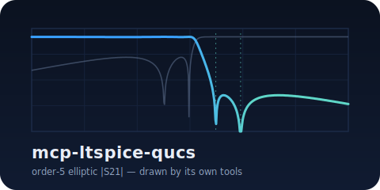

# mcp-ltspice-qucs

<p align="center">
  
</p>

A three-server **Model Context Protocol (MCP)** suite that turns RF
filter design and multi-radio coexistence engineering into a fluent
agent workflow. Use **LTspice** and **Qucs-S** through domain-aware
abstractions ("place a transmission zero at 1853 MHz", "evaluate
against this coex spec") instead of SPICE primitives.

## Why this exists

Designing a single coexistence-aware filter today looks like: hours in
LTspice nudging component values, swapping vendor SPICE models by hand,
re-running the sim, eyeballing the S21 trace, repeat. This suite codifies
the workflow so an LLM agent can iterate at the **design intent** layer,
collapsing each iteration from minutes to seconds while keeping a
human engineer in the loop for judgment calls.

## The three servers

| Server | Purpose | Tools |
|---|---|---|
| [`mcp-ltspice`](tools/ltspice.md) | LTspice (Wine) + ngspice fallback for filter synthesis, S-parameter extraction, vendor model substitution, optimization, Monte Carlo | 11 |
| [`mcp-qucs-s`](tools/qucs-s.md) | Qucs-S for native S-parameter sims, harmonic balance, microstrip + distributed-element synthesis | 10 |
| [`mcp-rf-analysis`](tools/rf-analysis.md) | Simulator-agnostic skrf wrappers, LTE/5G NR/GNSS/ISM/HaLow band databases, FCC/ETSI/3GPP spec evaluation, multi-radio coex matrix | 19 |

All three speak **Touchstone** (`.s2p` / `.snp`) as the cross-tool
exchange format and return a uniform [response envelope](reference/envelope.md).

## Headline demo

The [basic LPF example](examples/basic-lpf.md) synthesizes a 5th-order
Butterworth low-pass filter at 1 GHz, substitutes Coilcraft 0402HP +
Murata GJM C0G real parts, and runs a 1000-trial Monte Carlo at 5%
component tolerance — entirely through MCP tool calls. **All 5 spec
criteria pass with 99% yield.**

{ loading=lazy }

## Quickstart

```bash
git clone https://github.com/RFingAdam/mcp-ltspice-qucs
cd mcp-ltspice-qucs
uv sync --all-packages
uv run python examples/halow_lpf/design.py
```

See [Installation](installation.md) for ngspice / LTspice / Qucs-S
setup.

## License

Apache-2.0. See [LICENSE](https://github.com/RFingAdam/mcp-ltspice-qucs/blob/main/LICENSE).
