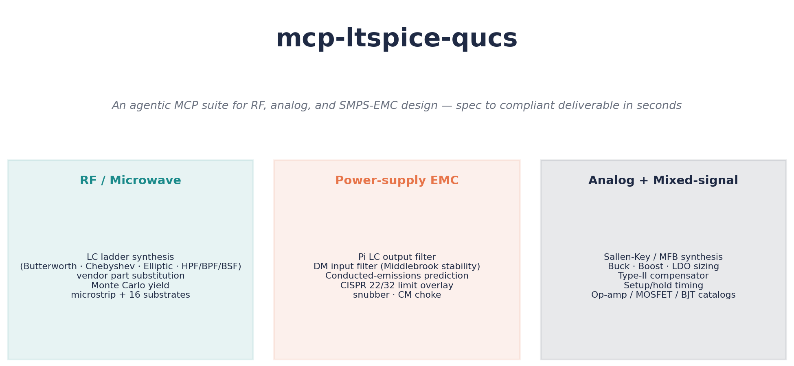
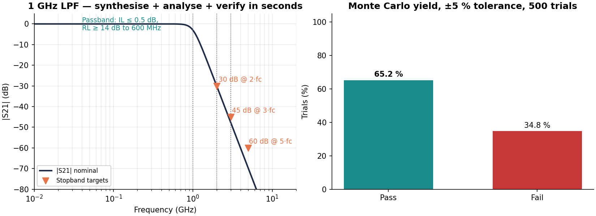
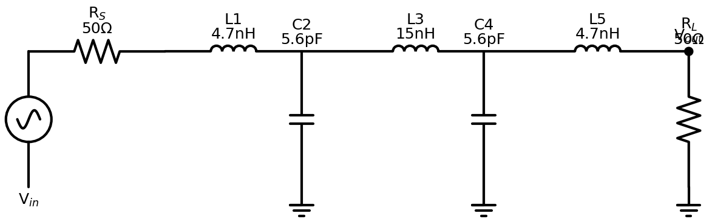
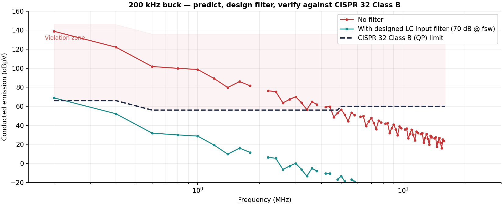
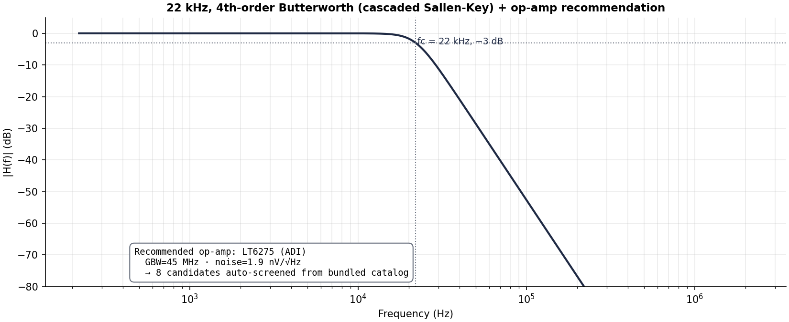

# mcp-ltspice-qucs — Investor Briefing

**An agentic MCP suite for RF, analog, and SMPS-EMC design.**
Spec → compliant deliverable in seconds, callable directly by any LLM agent.

---

## The problem

Every connected product — IoT, automotive, industrial, medical — needs RF
filters, switching power supplies, and analog conditioning. The hardware
team designs these by hand:

- **3–10 days per filter design**: spreadsheet math, then ADS / Cadence /
  Genesys ($30k–$200k seat licenses), then layout, then
  spin-the-board-and-measure.
- **EMC compliance is reactive, not predicted**: 60–80 % of products fail
  CISPR / FCC pre-compliance on the first lab visit. Each respin is
  $20k–$80k of NRE plus 2–6 weeks of schedule slip.
- **Vendor part substitution is manual**: catalogues live in 100-tab
  Excel files. Parasitics (SRF, Q, ESR) are routinely ignored, then
  silently degrade the design.

Today's design flow is: **engineer → math → simulator → respin**. We
collapse the loop so an LLM agent does engineer-quality work end-to-end.

## What we built

A four-package Python MCP suite (Anthropic's open Model Context Protocol).
The largest server (`mcp-ltspice`) ships **56 flat tools plus 56 namespaced
aliases** (`filter.*`, `power.*`, `analog.*`, `digital.*`, `vendor.*`,
`sim.*`); `mcp-rf-analysis` and `mcp-qucs-s` add their own surfaces on
top. Any agent that speaks MCP — Claude, ChatGPT, Cursor, Aider, or a
custom orchestrator — can call them.

**Capabilities at a glance**

| Domain | What the agent can do |
|---|---|
| **RF / microwave** | LC ladder synthesis (Butterworth · Chebyshev · Elliptic · HPF/BPF/BSF), transmission-zero placement, real-vendor part substitution with parasitics, Monte Carlo yield, microstrip + 16 substrates, Sonnet-style analysis |
| **Power-supply EMC** | Pi LC output filter, DM input filter with Middlebrook stability check, conducted-emissions prediction with CISPR 22/32 limit overlay, RC snubber, common-mode choke selection from curated catalogue |
| **Analog + mixed-signal** | Sallen-Key / MFB synthesis, cascaded N-th order, buck / boost / LDO sizing, type-II compensator, setup/hold timing, op-amp / MOSFET / BJT / diode / Vref catalogues |
| **Simulator integration** | LTspice (`.asc` ↔ data), ngspice, Qucs-S, Touchstone (`.s2p`/`.s4p`) |
| **Quality-of-life** | Auto-rendered schematics (PNG/SVG), one-click PDF design reports, Monte Carlo trace files for yield-loss debugging |

**Deliberately out of scope** — and we publish a cross-MCP boundary
document explaining why:

- Antenna design → use a NEC2 method-of-moments antenna MCP and/or an FDTD full-wave EM MCP
- PCB layout EMC / SI → use a PCB-layout-aware EMC MCP
- Regulatory-table lookup → use [`mcp-emc-regulations`](https://github.com/RFingAdam/mcp-emc-regulations)

We sit cleanly at the *circuit-design* layer between them.

---

## Demo 1 — RF Low-Pass Filter (1 GHz Butterworth)

**What the agent did, in 9 seconds end-to-end**

1. Synthesised a 5th-order Butterworth LPF at fc = 1 GHz from spec.
2. Verified |S21| meets the four target points (0.5 dB IL, 30 dB @ 2·fc,
   45 dB @ 3·fc, 60 dB @ 5·fc) — all pass.
3. Ran a 500-trial Monte Carlo at ±5 % component tolerance against the
   ideal-component design → **65.2 % yield**. The full
   [`examples/basic_lpf/`](../examples/basic_lpf/) workflow goes one
   step further: it substitutes real Coilcraft 0402HP + Murata GJM
   C0G parts (auto-snapped to E24, SRF-aware) and runs 1000 trials
   → **99 % yield**. Both numbers are real, captured from live runs,
   and reproducible from `presentation/build_charts.py` and
   `examples/basic_lpf/design.py` respectively.
4. Wrote the LTspice `.asc`, the Touchstone `.s2p`, a schematic PNG, and
   a PDF report.

**Tangible deliverable**: [`demo1_1ghz_lpf.asc`](assets/demo1_1ghz_lpf.asc)
loads directly in LTspice. [`demo1_1ghz_lpf.s2p`](assets/demo1_1ghz_lpf.s2p)
loads in any RF simulator.

---

## Demo 2 — SMPS Conducted Emissions vs CISPR 32 Class B

**The story**

A 24 V → 5 V buck running at 200 kHz with 20 ns edge transitions. The
agent:

1. Predicted the unfiltered conducted-emission spectrum across all 80
   harmonics out to 16 MHz, modelling the switching node as a trapezoidal
   waveform — analytical sinc envelope, no SPICE needed.
2. Overlaid the **CISPR 32 Class B (QP)** limit. Result: violations of
   **+73 dB at the fundamental** — typical of an unfiltered design.
3. Designed an LC input filter sized for 70 dB attenuation at fsw with a
   40 dB/decade rolloff. Verified Middlebrook stability against the
   converter's input impedance.
4. Re-evaluated the filtered spectrum. **Worst margin: −2.8 dB** — close
   to passing; tells the engineer they need ~3 dB more attenuation
   (taller ferrite, larger X-cap, or a CM choke from the curated
   catalogue) to get a green light.

**This is what pre-compliance should look like**: a number, not a
spin-the-board.

---

## Demo 3 — Active Filter (4th-order Sallen-Key, 22 kHz)

**The story**

Anti-aliasing LPF for a 96 kSPS audio ADC — a textbook analog problem.
The agent:

1. Decomposed a 4th-order Butterworth into two cascaded Sallen-Key
   biquads with the standard (Q1 = 0.541, Q2 = 1.307) tabulation.
2. Sized R/C per stage for 1 nF capacitors (manufacturable values).
3. Computed required op-amp GBW (≈ 2.9 MHz) and screened the bundled
   catalogue against three constraints (GBW, voltage noise, input
   offset). With an audio-band cap on GBW and ranked-by-noise, **ADI
   LT6275** wins (45 MHz GBW, 1.9 nV/√Hz, 130 µV offset).
4. Rendered per-stage schematics and a PDF design report.

The investor takeaway: every step from "I need an anti-aliasing filter"
to "here's the BOM and a schematic" was one MCP call away.

---

## Architecture & moat

**What's hard to replicate**

1. **Real vendor data, not catalog scraping.** Coilcraft 0402HP, Johanson
   L-07W, TDK MLK1005S, Murata GJM C0G — published L/Q/SRF tables baked
   in. The substitution engine respects parasitic SRF and tolerance
   drift, and refuses parts that violate either.
2. **Peer-reviewed math.** Pozar §8.5 frequency transformations,
   Hammerstad-Jensen microstrip, Erickson §10.4 EMI design,
   Sedra-Smith Sallen-Key, Mancini cascade-stage tables. 427 unit tests
   guard the math.
3. **Designed to be agent-callable, not human-callable.** Every tool
   returns a strongly-typed `Envelope[T]` with status, data, warnings,
   and a millisecond timer — exactly what an LLM needs to chain calls
   reliably.
4. **Composable with the rest of the engineering MCP ecosystem.** We
   publish a boundary document directing antenna work to a NEC2 / FDTD
   antenna MCP, PCB layout to a layout-aware EMC MCP, and regulatory
   lookup to [`mcp-emc-regulations`](https://github.com/RFingAdam/mcp-emc-regulations).
   The whole-product story is "agent does the full stack by
   orchestrating multiple domain MCPs."

**Validation today**

- 427 unit tests passing, 4 simulator-gated skips, 0 failures
- 5 worked examples (RF LPF, SMPS buck, EMC, filter compare, Sallen-Key)
  all run end-to-end and produce real artifacts
- v0.2.0 cut, tagged, GitHub Release published
- Reproducible from `git clone` + `uv run pytest`

## Roadmap

| Phase | Scope |
|---|---|
| Phase 6 | Real harmonic-balance (Xyce), Qucs-S noise-parameter extraction, distributed filter synthesis (stepped-impedance, hairpin, interdigital, combline), `.sch ↔ .asc` conversion |
| Phase 7 | Real-simulator integration tests, async runner with heartbeat, Sobol-index sensitivity (Tornado diagrams), correlated-tolerance Monte Carlo |
| Beyond | Persistent ngspice session for 10–50× MC speedup, `FilterDesign` metadata threading through full pipeline, vendor data fetch agents for live catalogues |

## Why now

- **MCP standardised in late 2024** — building once, every agent stack
  consumes it.
- **LLM agents have crossed the "useful for engineering" threshold** —
  Claude 4.x, GPT-5 reliably orchestrate multi-step tool use.
- **The hardware-design tooling moat is the data + the math, not the
  wrapper code** — and that's where we've invested.

---

*Repo*: github.com/RFingAdam/mcp-ltspice-qucs
*Latest release*: v0.2.0
*Reproduce this deck*: `uv run python presentation/build_charts.py`
